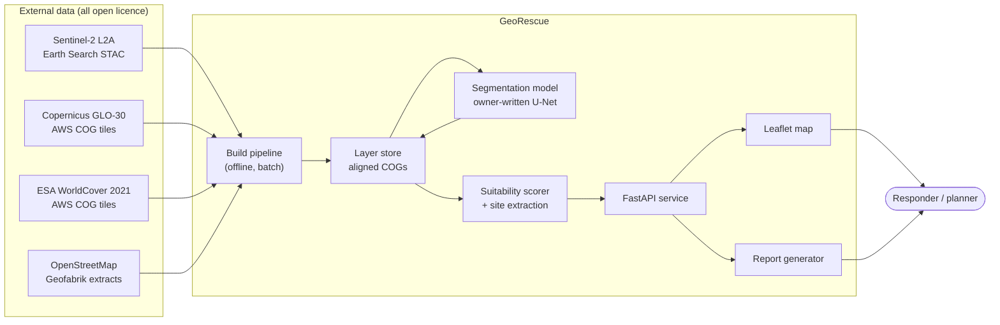
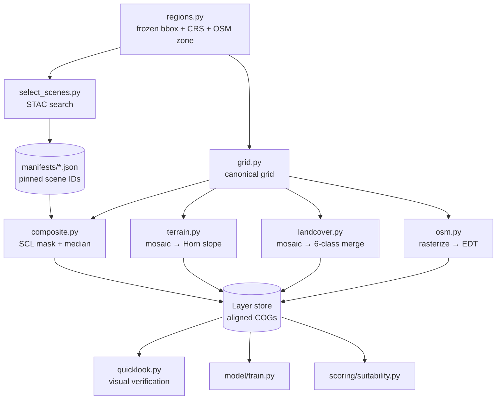
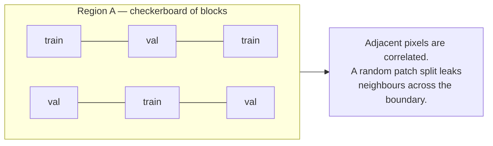
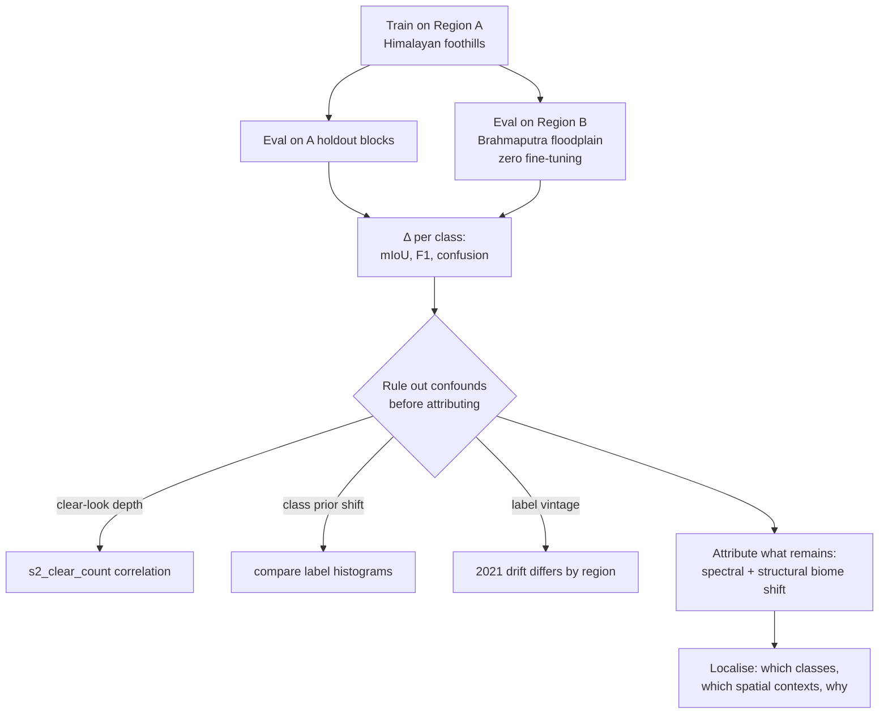
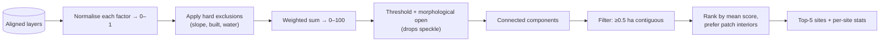
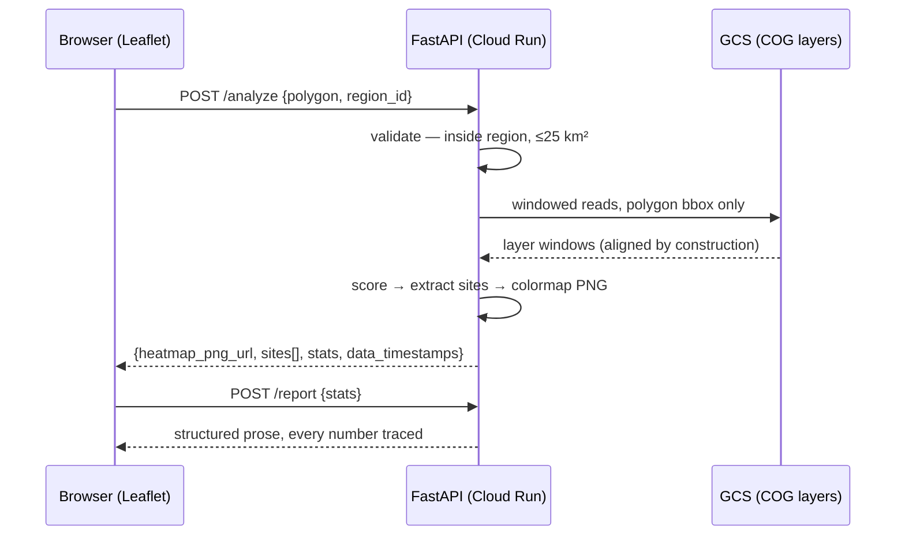

# GeoRescue — System Design & Architecture

**AI terrain intelligence for post-disaster shelter siting.**
Multimodal site-suitability over Sentinel-2 imagery, terrain and infrastructure,
served as an interactive map with grounded, zero-hallucination reports.

| | |
|---|---|
| **Status** | Phase 1 — Region A data foundation complete; Region B in progress; scorer is the last link |
| **Scale** | 2 regions × ~3,850 km² × 10 m = 40.5 Mpx per layer |
| **Budget** | ₹0 build · ₹0–500/mo serving (scale-to-zero) |
| **Companion docs** | project spec (the plan, binding) · decision log (every choice + rationale) · build log (audit trail) · progress tracker — all maintained alongside this document |

---

## 1. Design principles

These are the constraints every component below answers to. They are not aspirations;
each one has already changed a decision, cited inline.

| # | Principle | Enforced by |
|---|---|---|
| P1 | **One grid per region.** Every raster shares CRS, transform and shape exactly. | `assert_matches()` raises at load — #008 |
| P2 | **Honest labeling.** No output claims more certainty than its inputs support. | Composite is labeled a Jan–Apr window, never a date; flood layer labeled a proxy — #009 |
| P3 | **Reproducible over fresh.** A result that can't be re-derived can't be defended. | Scene manifests pinned to JSON; Geofabrik extract over live Overpass — #007, #013 |
| P4 | **Owned core.** The model and the scorer are hand-written, explainable line by line. | Spec §14.1 — no pretrained encoder in v1 |
| P5 | **Product before model.** Ships on the WorldCover baseline; the model swaps in behind a toggle. | Build order §10 — the product is never hostage to a training run |
| P6 | **Measure, then attribute.** Never explain a degradation before ruling out its confounds. | Clear-look count raster exists precisely to falsify "the biome did it" — #009 |

---

## 2. System context



**Boundary decisions.** Two precomputed regions, not draw-anywhere-on-Earth: global
on-demand means fetch + infer per request, 30–120 s latency and a flaky demo. Instant
regions demo better; global is post-v1 (spec §12).

---

## 3. Data plane

### 3.1 Sources

| Source | Resolution | Licence | Role | Why this one |
|---|---|---|---|---|
| Sentinel-2 C1 L2A | 10 m | Free, open | Imagery, model input | Collection-1 = consistent processing baseline across the archive — #002 |
| Copernicus GLO-30 | 30 m | Free, open | Elevation → slope, flood proxy | Global, no auth, COG-native |
| ESA WorldCover 2021 | 10 m | CC BY 4.0 | Baseline land cover + weak labels | Only free global 10 m land cover — C014 |
| OpenStreetMap | vector | ODbL | Roads, water | Geofabrik zone extract, pinned — #013 |

Rejected: Copernicus Data Space (account + quota), Google Earth Engine (closed runtime —
the pipeline wouldn't be ours), FABDEM (correct DTM, but CC-BY-NC-SA breaks redistribution).

### 3.2 The grid contract — the load-bearing invariant

Every raster in a region is written on one grid, defined once:

```
Region A   EPSG:32644   5953 × 6804 px   10 m   origin (186140, 3378690)
Region B   EPSG:32646   7004 × 5603 px   10 m   origin (579260, 3003940)
```

Derived from the frozen bbox, densified 21 points/edge before reprojection (a lat/lon
rectangle becomes a curved quadrilateral in UTM), snapped outward to whole 10 m.

`assert_matches(grid, dataset)` raises on any CRS, transform or shape mismatch. This is
the mitigation for the highest-likelihood risk in the register: on a first geospatial
project, pairwise alignment is how silent half-pixel shifts get in, and a shifted
suitability map looks perfectly plausible.

> **Corollary that already bit once.** A UTM rectangle's corners sit *outside* the lat/lon
> bbox, so any source mosaicked in geographic coordinates must be padded (0.05°) before
> merging or the grid edges starve. Caught at 5.01 % nodata by a printed count, not a
> test — #012.

### 3.3 Layer inventory

| Layer | dtype | nodata | Built by | A | B |
|---|---|---|---|---|---|
| `s2_composite.tif` (B2,B3,B4,B8) | uint16 | 0 | `pipeline/composite.py` | ✅ | 🟡 |
| `s2_clear_count.tif` | uint8 | 0 | `pipeline/composite.py` | ✅ | 🟡 |
| `dem.tif` | float32 | −9999 | `pipeline/terrain.py` | ✅ | ✅ |
| `slope.tif` (degrees) | float32 | −9999 | `pipeline/terrain.py` | ✅ | ✅ |
| `landcover.tif` (6-class) | uint8 | 0 | `pipeline/landcover.py` | ✅ | ✅ |
| `dist_road.tif` (metres) | float32 | −1 | `pipeline/osm.py` | ✅ | ✅ |
| `dist_water.tif` (metres) | float32 | −1 | `pipeline/osm.py` | ✅ | ✅ |
| `landcover_model.tif` | uint8 | 0 | `model/predict.py` | ⬜ Phase 3 | ⬜ Phase 4 |
| `suitability.tif` | uint8 | 0 | `scoring/suitability.py` | 🟡 scorer owner-authored | 🟡 |

All tiled 512×512, deflate-compressed, predictor 2 for integers / 3 for floats — the
COG layout, so windowed reads over HTTP stay cheap once these live on GCS.

### 3.4 Build DAG



Every stage is idempotent and independently runnable. `composite.py` additionally
checkpoints per stripe, so a dropped connection resumes rather than restarts.

---

## 4. ML system design

### 4.1 Task framing

Semantic segmentation, Sentinel-2 → 6 land-cover classes, as a *component of a decision
system* rather than an end in itself. That framing drives three choices most segmentation
projects don't make:

- **6 classes, not 11.** Scoring only distinguishes these six; extra legend detail is
  vanity that slows convergence (spec §12).
- **Per-class F1 on the scoring-critical classes** (built, water, trees) outranks mIoU,
  because those three drive exclusions.
- **The model must beat the baseline on the *downstream* map**, not just on pixels.

### 4.2 Label strategy — weak supervision, and its honest accounting

WorldCover 2021 is the label source. Two known defects, both stated rather than hidden:

| Defect | Magnitude | Consequence |
|---|---|---|
| Temporal drift | Labels 2021, imagery 2026 | Some "errors" are real post-2021 construction in a fast-growing Dehradun |
| Class imbalance | trees 70.05 % ↔ water 0.43 % (**163:1**) | Pixel accuracy is meaningless; a constant "trees" predictor scores 70 % |

Measured shares, both regions — and the gap between the columns *is* the shift chapter:

| class | Region A | Region B |
|---|---|---|
| trees | 70.05 % | 28.91 % |
| cropland | 16.07 % | 48.91 % |
| shrub + grassland | 7.00 % | 4.40 % |
| built-up | 5.21 % | 1.53 % |
| bare / sparse | 1.24 % | 1.11 % |
| water + wetland | **0.43 %** | **15.15 %** |

Built and water — the two rarest in A after bare — are exactly the classes §8 calls
scoring-critical. And water is **35× more prevalent in B**, which is prior shift, not
spectral difference (§4.7, C018).

**This asymmetry is an opportunity, not only noise.** Gate 3's bar is that the model beat
"just use WorldCover" on 2026 imagery in at least one demonstrable way. Detecting
post-2021 built-up change is the natural candidate, and it is measurable.

### 4.3 Split protocol — spatial blocks, never random



Binding rule (§8). A random pixel or patch split puts a patch's own neighbours in the
validation set — the same leakage class as a temporal split done wrong, and it inflates
every metric. Contiguous geographic blocks are held out instead, and the writeup says so
explicitly rather than quietly doing the right thing.

### 4.4 Model

Hand-written U-Net, ~4 depth levels, plain encoder-decoder, **no pretrained encoder in
v1**. That costs a few mIoU points and buys the one thing the project cannot outsource:
every layer explainable under questioning (P4, spec §12).

```
Input  256×256×4   (B2,B3,B4,B8; per-region normalisation stats frozen and documented)
Enc    C64 → C128 → C256 → C512      (each: 2× [conv3×3 → BN → ReLU], maxpool)
Bottle C1024
Dec    ×4 [upconv → concat skip → 2× conv-BN-ReLU]
Head   1×1 conv → 6 logits
```

Inference is tiled with overlap; predictions are blended on the seam so tile boundaries
don't print into the map.

### 4.5 Loss, metrics, imbalance

| Concern | Choice | Why not the obvious alternative |
|---|---|---|
| Loss | class-weighted CE + Dice | Plain CE collapses to trees at 163:1 |
| Weighting | median-frequency balancing | Inverse-frequency at 163:1 makes water gradients violent |
| Ignore label | class 0 | Snow maps here rather than into "bare", which §7 treats as *ideal* ground — #011 |
| Metrics | mIoU, per-class F1, confusion matrix | Pixel accuracy is uninformative at this imbalance |
| Baseline | agreement-with-WorldCover on holdout blocks | It is the floor to beat, not the target |

### 4.6 Reproducibility & experiment discipline

Everything that determines a result is either pinned in git or emitted as a run artifact:

- **Data**: scene IDs pinned in `pipeline/manifests/*.json`; OSM as a dated Geofabrik
  extract; DEM/WorldCover are static versioned products.
- **Config**: one dataclass per run, hashed into the run directory name.
- **Seeds**: fixed and logged; block split derived deterministically from the grid.
- **Artifacts per run**: config, seed, metrics JSON, confusion matrix, per-class F1,
  qualitative tiles from held-out blocks, and a model card stating training window,
  label vintage, and known failure modes.

Deliberately *not* adopted: MLflow/W&B servers, DVC, a feature store. At 3–6 training runs
they are ceremony; the same guarantees come from pinned manifests plus a run directory.

### 4.7 Cross-region shift protocol (the differentiator)



The diagnosis is the contribution — measure the degradation, localise it, explain the
mechanism. Remediation (fine-tuning, domain adaptation) is an explicit stretch; if it
doesn't ship it is documented as next steps, not hidden (spec §12).

Confound control is not optional here. Region A's eastern ~10 % has only 4–7 clear looks
versus ~14 in the tile-overlap centre; that is a *spatial* quality gradient that would
masquerade as a biome effect if left unchecked — #009.

### 4.8 Currency: where this sits in 2026 practice

Geospatial ML has moved to EO foundation models — Prithvi-EO-2.0, Clay and DOFA now ship
as ready-to-use backbones in mainstream GIS tooling, and TESSERA released 10 m Sentinel
embeddings in 2025–26. Ignoring that would date the project.

The response is deliberate: **the hand-written U-Net stays the owned core** (P4), and the
Phase-5 stretch benchmarks one foundation model against it *under the identical A→B shift
protocol* — same splits, same metrics, same table. That is the comparison a specialist
actually wants to see, and it reads as current without surrendering ownership.

---

## 5. Decision layer — scoring and site extraction

### 5.1 Weighted overlay

| Factor | Source layer | v1 rule | Weight |
|---|---|---|---|
| Slope | `slope.tif` | ≤5° ideal; 5–10° linear penalty; >15° **excluded** | 0.30 |
| Land cover | `landcover.tif` or model | grass/shrub/bare ideal; crop penalised; trees heavy; built/water/wetland **excluded** | 0.30 |
| Flood proxy | `dem.tif` + water | elevation delta above nearest water; <5 m within 1 km heavily penalised | 0.20 |
| Road access | `dist_road.tif` | distance decay; >5 km penalised | 0.10 |
| Water supply | `dist_water.tif` | sweet-spot band — near but not flood-exposed | 0.10 |

Thresholds are **v1 defaults pending a standards check** (UNHCR site planning / Sphere).
Until sourced they are not presented as certified — P2.

### 5.2 From score surface to candidate sites



"Prefer patch interiors" is not cosmetic. GLO-30 is a **DSM** — canopy and buildings are
in the elevation, so a flat field ringed by forest gets a false steep rim. Slope and land
cover each carry 0.30 weight and **their errors correlate at exactly those boundaries**,
so an edge pixel is the least trustworthy pixel in the stack — #010.

### 5.3 Sensitivity as a first-class output

The weights are opinions. A system that hides that is overclaiming. The scorer therefore
also reports how the top-5 set changes under weight perturbation — if the ranking is
unstable under ±20 % on one weight, the report says so.

---

## 6. Serving architecture

### 6.1 Request path



**Latency budget ≤10 s warm** for 25 km². It is met by precomputation, not by being
clever at request time: all five factor layers are built offline, model inference is
precomputed per region, and the request does a windowed read plus a weighted sum. If the
budget is ever breached, the escape hatch is caching the scored raster per region and
clipping at request time.

### 6.2 Deployment topology

| Concern | Choice | Rationale |
|---|---|---|
| Compute | Cloud Run, scale-to-zero | ₹0 when idle; the demo is bursty by nature |
| Storage | GCS, COGs | Windowed HTTP reads — the same access pattern the pipeline already uses |
| Image | Slim Docker, pinned wheels | Plain venv + wheels reproduces exactly — #003 |
| Inference | CPU, tiled | A 6-class U-Net at 256 px does not need a GPU to serve |
| State | None | Every request is pure; layers are immutable artifacts |

### 6.3 Report generation — the zero-hallucination path

**v1 is deterministic.** Computed stats slotted into structured prose: verdict, ranked
sites table, exclusions triggered, caveats, data timestamps, attributions. Zero
hallucination surface because there is no generation.

**v1.5 (only after Phase 4)** allows an LLM to write the prose, constrained to the stats
JSON, with a hard automated check: regex-extract every numeral from the output and assert
membership in the input JSON. A number that isn't in the input fails the response.

This ordering is P2 in practice — the flashy version is allowed only after the honest
version ships.

---

## 7. Cross-cutting concerns

| Concern | How it is handled |
|---|---|
| **Alignment correctness** | `assert_matches` at every write and load; fail loud, never warn |
| **Composite honesty** | `s2_clear_count.tif` ships alongside — composite quality is auditable, not asserted |
| **Data provenance** | Every report carries `data_timestamps`: imagery window, DEM version, WorldCover vintage, OSM extract date |
| **Failure modes** | Documented per layer in `DECISIONS.md`, surfaced in report caveats |
| **Observability** | Every builder prints a nodata count and a distribution — the padding bug was caught by exactly this |
| **Testing** | 62 tests, offline. Both safety nets have regression tests, including a corner-only mask reproducing the S010 failure. Gap: no end-to-end builder test — every builder needs the network |
| **Cost** | ₹0 build (all sources open, free-tier GPU); ₹0–500/mo serving |

---

## 8. Risk register → architecture response

| Risk | Response in this design | Where |
|---|---|---|
| Cloud wrecks composites | Jan–Apr window + per-pixel SCL mask + median over ~12 looks | §3.3, #001/#009 |
| CRS / alignment bugs | One grid per region, asserted at load | §3.2, #008 |
| Class imbalance | 6-class merge, weighted loss, per-class F1 from run 1 | §4.5, #011 |
| Endpoint friction | Day-1 verification of all five sources; fallbacks listed | `verify_sources.py` |
| CPU inference too slow | Precomputed inference rasters, tiled reads, 25 km² cap | §6.1 |
| Agent-written code the owner can't explain | §14 protocol; owner authors model + scorer; ledger entry per concept | P4 |
| Scope creep | §3 non-goals; changes allowed to endpoints/bboxes/UI, banned for new directions | spec §12 |

---

## 9. Build state

| Phase | Deliverable | State |
|---|---|---|
| 1 — Data foundation | Aligned stacks both regions; CLI heatmap | 🟡 Region A complete; Region B 4/5; scorer outstanding (S004–S013) |
| 2 — Product live | Deployed URL, draw → heatmap → report | ⬜ |
| 3 — Training arc | Owner-written U-Net, eval report, UI toggle | ⬜ |
| 4 — Shift chapter | Full pipeline on Region B, degradation quantified | ⬜ |
| 5 — Polish + stretch | README, diagram, writeup; FM benchmark | ⬜ |

Original spec dates are void — the build paused 13–30 Jul and was re-planned against
20 h/week. Phases are a progress lens, not a schedule.

**Immediate path to Gate 1: one function.** Layers ✅ · loading and validation ✅ ·
site extraction ✅ · heatmap and report JSON ✅ · tests ✅. `scoring/suitability.py::score()`
is owner-authored and stubbed; when it returns, `python -m scoring.analyze --region A`
produces the Gate 1 deliverable with no other change.

---

## 10. Decision index

Full rationale for every choice lives in `DECISIONS.md`. Index:

| # | Decision |
|---|---|
| 001 | Jan–Apr 2026 imagery window |
| 002 | Earth Search STAC, `sentinel-2-c1-l2a` |
| 003 | Plain venv + wheels, no conda |
| 004 | Region bounding boxes (frozen) |
| 005 | Product name — GeoRescue |
| 006 | Public-repo boundary |
| 007 | Scene selection: ≤30 % cloud, 12/tile, pinned manifests |
| 008 | One canonical grid per region, enforced at load |
| 009 | Composite = per-pixel median of SCL-masked scenes |
| 010 | Slope: Horn at native 30 m, then resampled |
| 011 | WorldCover 11 → 6 classes, 0 = ignore |
| 012 | Mosaic windows must be padded past the bbox |
| 013 | OSM via pinned Geofabrik extract, drivable-road filter |
| 014 | Region B stack; A→B shift measured, prior vs covariate separated |
